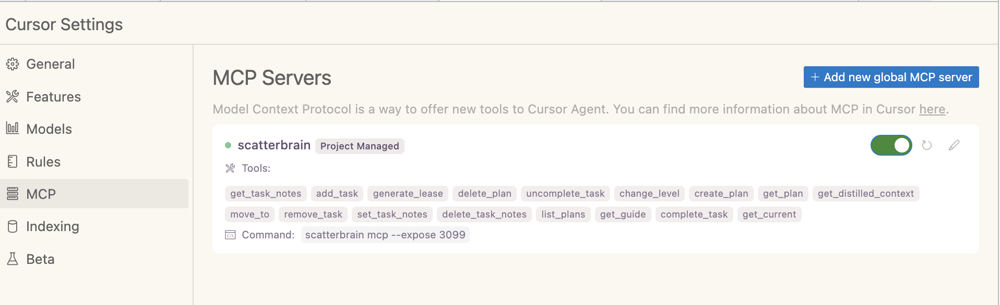

# Scatterbrain: _Stop babysitting your AI_

**A hierarchical planning and task management tool with powerful MCP server integration for AI assistants**

[](https://github.com/owen-d/scatterbrain)
[](https://github.com/owen-d/scatterbrain/releases/latest)
[](https://github.com/owen-d/scatterbrain)
[](LICENSE)

Scatterbrain keeps an AI Agent on task, so you don't have to. It does this by treating the AI to act as a planner and implementer, in alternating fashion. This helps the AI break down complex problems into manageable, hierarchical tasks and more importantly, keeps it on track. Its primary strength lies in its **Model Context Protocol (MCP) server**, which seamlessly integrates with AI assistants like Claude and Cursor, enabling intelligent task management and planning workflows.

## 🎬 Demo

https://github.com/user-attachments/assets/4ae59dc5-9027-4ecd-adf0-97b8bbba9ac9

## 🚀 Quick Start (MCP Server)

<details>
<summary>Installation Options</summary>

### Pre-built Binaries (Recommended)

**Shell Script (macOS/Linux):**
```bash
curl --proto '=https' --tlsv1.2 -LsSf https://github.com/owen-d/scatterbrain/releases/latest/download/scatterbrain-installer.sh | sh
```

**PowerShell (Windows):**
```powershell
powershell -ExecutionPolicy Bypass -c "irm https://github.com/owen-d/scatterbrain/releases/latest/download/scatterbrain-installer.ps1 | iex"
```

**Direct Download:**
Download pre-built binaries for your platform from the [latest release](https://github.com/owen-d/scatterbrain/releases/latest):
- **macOS**: `scatterbrain-aarch64-apple-darwin.tar.xz` (Apple Silicon) or `scatterbrain-x86_64-apple-darwin.tar.xz` (Intel)
- **Linux**: `scatterbrain-x86_64-unknown-linux-gnu.tar.xz` (x64) or `scatterbrain-aarch64-unknown-linux-gnu.tar.xz` (ARM64)
- **Windows**: `scatterbrain-x86_64-pc-windows-msvc.zip`

### Build from Source

```bash
# Install Rust if you haven't already
curl --proto '=https' --tlsv1.2 -sSf https://sh.rustup.rs | sh

# Clone and build scatterbrain
git clone https://github.com/owen-d/scatterbrain.git
cd scatterbrain
cargo build --release

# Install globally (optional)
cargo install --path .
```

</details>

### MCP Server Setup

#### For Cursor

Once installed, all you need to do is add the following to your Cursor MCP configuration (expose is optional, but allows you to follow progress via the web interface):

```json
{
  "mcpServers": {
    "scatterbrain": {
      "command": "scatterbrain",
      "args": [
        "mcp",
        "--expose",
        "3099"
      ],
      "env": {}
    }
  }
}
```



#### Planning Interface

Scatterbrain's hierarchical planning system helps you break down complex projects into manageable tasks across multiple abstraction levels:


As you work through your plan, the interface shows your progress and maintains context across all levels:


## ✨ Features

### 🎯 Hierarchical Task Management
- **"leveled" abstraction system**: Planning → Isolation → Ordering → Implementation
- Break complex projects into manageable pieces
- Natural progression from high-level goals to specific actions

### 🤖 MCP Server Integration
- **specialized tools** for AI assistants
- Plan creation, task management, navigation, and notes
- Seamless integration with Cursor, Claude, and other MCP-compatible tools

### 🌐 Web Interface
- Modern browser-based UI for visual task management
- Real-time updates and intuitive navigation
- Access via `--expose` flag when running MCP server

### 💻 Powerful CLI
- Complete command-line interface for all operations
- Shell completions for bash, zsh, fish
- Environment variable support for workflow integration

<details>
<summary>Usage Modes</summary>

## MCP Server (Recommended)
Perfect for AI-assisted development and planning:
```bash
scatterbrain mcp --expose 8080
```
- Provides MCP tools to AI assistants
- Optional web UI access
- Ideal for collaborative AI workflows

## CLI Usage
Direct command-line interaction:
```bash
# Create a plan
scatterbrain plan create "Build documentation system"

# Add tasks and navigate
export SCATTERBRAIN_PLAN_ID=1
scatterbrain task add --level 0 "Design architecture" --notes "High-level planning"
scatterbrain move 0
```

## HTTP API Server
Standalone web server:
```bash
scatterbrain serve --port 3000
```
- Full REST API access
- Web UI at http://localhost:3000
- Programmatic integration

## Combined Mode
Best of all worlds:
```bash
scatterbrain mcp --expose 8080
```
- MCP server for AI assistants
- Web UI for visual management
- CLI access for scripting

</details>

<details>
<summary>Documentation</summary>

- **[MCP Integration Guide](docs/MCP-GUIDE.md)** - Complete guide to using scatterbrain with AI assistants
- **[CLI Reference](docs/CLI-REFERENCE.md)** - Comprehensive command documentation
- **[Web UI Guide](docs/WEB-UI.md)** - Browser interface walkthrough
- **[Examples & Patterns](docs/EXAMPLES.md)** - Real-world usage scenarios
- **[Architecture Overview](docs/ARCHITECTURE.md)** - System design and concepts

</details>

## 🎯 Core Concepts

### Hierarchical Planning
Scatterbrain organizes work across four abstraction levels:

1. **Planning (Level 0)** - High-level goals and architecture
2. **Isolation (Level 1)** - Independent components and boundaries  
3. **Ordering (Level 2)** - Sequence and dependencies
4. **Implementation (Level 3)** - Concrete, actionable tasks

### MCP Tools
When running as an MCP server, scatterbrain provides these tools to AI assistants:

- `get_plan` - Retrieve plan details and structure
- `create_plan` - Create new plans from prompts
- `add_task` - Add tasks at appropriate abstraction levels
- `complete_task` - Mark tasks as completed with summaries
- `move_to` - Navigate between tasks
- `get_current` - Get current task context
- `get_distilled_context` - Get focused planning context
- And 10 more specialized tools for comprehensive task management

## 📄 License

This project is licensed under the MIT License - see the [LICENSE](LICENSE) file for details.

<details>
<summary>Links & Resources</summary>

- [GitHub Repository](https://github.com/owen-d/scatterbrain)
- [Latest Release](https://github.com/owen-d/scatterbrain/releases/latest)
- [Issue Tracker](https://github.com/owen-d/scatterbrain/issues)
- [Model Context Protocol](https://modelcontextprotocol.io/)
- [Cursor Editor](https://cursor.sh/)

</details>
